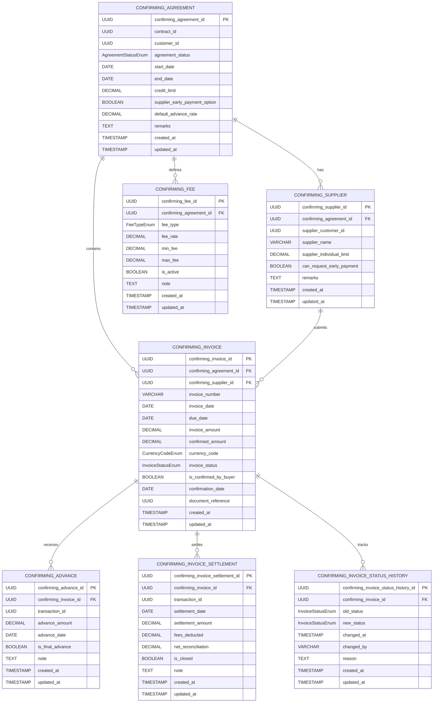

# Core Lending Confirming Service

[](https://opensource.org/licenses/Apache-2.0)
[](https://openjdk.java.net/projects/jdk/21/)
[](https://spring.io/projects/spring-boot)

## Overview

The **Core Lending Confirming Service** is a microservice component of the **Firefly OpenCore Banking Platform** developed by **Firefly Software Solutions Inc**. This service manages reverse factoring (confirming) arrangements, where financial institutions provide early payment to suppliers on behalf of buyers, who then settle with the institution at a later date.

The service provides comprehensive APIs for managing confirming agreements, suppliers, invoices, advances, fees, and settlements, enabling efficient supply chain financing operations.

## About Firefly OpenCore Banking Platform

The Firefly OpenCore Banking Platform is an open-source, cloud-native banking platform designed to accelerate digital transformation in financial services. Built with modern microservices architecture, it provides a comprehensive suite of banking capabilities including lending, payments, account management, and more.

- **Website**: [getfirefly.io](https://getfirefly.io)
- **GitHub Organization**: [firefly-oss](https://github.com/firefly-oss)
- **License**: Apache 2.0

## Architecture

The service follows a modular, hexagonal architecture with clear separation of concerns:

### Module Structure

```
core-lending-confirming/
├── core-lending-confirming-interfaces/    # API contracts and DTOs
├── core-lending-confirming-models/        # Data models and repositories
├── core-lending-confirming-core/          # Business logic and services
├── core-lending-confirming-web/           # REST controllers and web layer
└── core-lending-confirming-sdk/           # Client SDK and OpenAPI specs
```

- **interfaces**: Contains Data Transfer Objects (DTOs), service interfaces, and enums that define the API contracts
- **models**: Contains JPA entities, repositories, and database migration scripts
- **core**: Contains business logic, service implementations, and domain services
- **web**: Contains REST controllers, exception handlers, and web configuration
- **sdk**: Contains client SDK and OpenAPI specifications for external integration

### Technology Stack

- **Java 21**: Modern Java with latest language features
- **Spring Boot 3.x**: Application framework with auto-configuration
- **Spring WebFlux**: Reactive web framework for non-blocking I/O
- **Spring Data R2DBC**: Reactive database access
- **PostgreSQL**: Primary database with UUID support
- **Flyway**: Database migration and versioning
- **Maven**: Build and dependency management
- **Docker**: Containerization and deployment
- **OpenAPI 3**: API documentation and specification

## Domain Model

The service manages the following core business entities in the confirming (reverse factoring) domain:

### Core Entities

- **Confirming Agreement**: Master agreement between buyer and financial institution
- **Confirming Supplier**: Suppliers enrolled in a confirming agreement
- **Confirming Invoice**: Invoices submitted for confirming by suppliers
- **Confirming Advance**: Early payment advances made against invoices
- **Confirming Fee**: Fee structures and calculations for agreements
- **Confirming Invoice Settlement**: Final settlement records for invoices
- **Confirming Invoice Status History**: Audit trail of invoice status changes

### Business Flow

1. **Agreement Setup**: Financial institution creates confirming agreement with buyer
2. **Supplier Enrollment**: Suppliers are enrolled in the agreement with individual limits
3. **Invoice Submission**: Suppliers submit invoices for buyer confirmation
4. **Buyer Confirmation**: Buyer confirms invoice validity and payment terms
5. **Early Payment**: Financial institution provides advance payment to supplier
6. **Settlement**: Buyer settles with financial institution at maturity

## Entity Relationship Diagram



### Enums

- **AgreementStatusEnum**: `ACTIVE`, `CLOSED`, `SUSPENDED`, `TERMINATED`
- **InvoiceStatusEnum**: `CONFIRMED`, `EARLY_PAID`, `SETTLED`, `CANCELED`, `DISPUTED`, `DEFAULTED`
- **CurrencyCodeEnum**: `EUR`, `USD`, `GBP`, `CHF`
- **FeeTypeEnum**: `DISCOUNT_FEE`, `ADMIN_FEE`, `SERVICE_FEE`, `LATE_FEE`, `EARLY_PAYMENT_FEE`

## API Endpoints

The service exposes RESTful APIs for managing confirming entities. All endpoints are versioned (v1) and follow a hierarchical structure.

### Base URL

```
/api/v1
```

### Endpoints

- **Confirming Agreements**
  - `GET /confirming-agreements`: List or search agreements
  - `POST /confirming-agreements`: Create a new agreement
  - `GET /confirming-agreements/{confirmingAgreementId}`: Get an agreement by ID
  - `PUT /confirming-agreements/{confirmingAgreementId}`: Update an agreement
  - `DELETE /confirming-agreements/{confirmingAgreementId}`: Delete an agreement

- **Confirming Suppliers**
  - `GET /confirming-agreements/{confirmingAgreementId}/suppliers`: List or search suppliers
  - `POST /confirming-agreements/{confirmingAgreementId}/suppliers`: Create a new supplier
  - `GET /confirming-agreements/{confirmingAgreementId}/suppliers/{confirmingSupplierId}`: Get a supplier by ID
  - `PUT /confirming-agreements/{confirmingAgreementId}/suppliers/{confirmingSupplierId}`: Update a supplier
  - `DELETE /confirming-agreements/{confirmingAgreementId}/suppliers/{confirmingSupplierId}`: Delete a supplier

- **Confirming Invoices**
  - `GET /confirming-agreements/{confirmingAgreementId}/invoices`: List or search invoices
  - `POST /confirming-agreements/{confirmingAgreementId}/invoices`: Create a new invoice
  - `GET /confirming-agreements/{confirmingAgreementId}/invoices/{confirmingInvoiceId}`: Get an invoice by ID
  - `PUT /confirming-agreements/{confirmingAgreementId}/invoices/{confirmingInvoiceId}`: Update an invoice
  - `DELETE /confirming-agreements/{confirmingAgreementId}/invoices/{confirmingInvoiceId}`: Delete an invoice

- **Confirming Advances**
  - `GET /confirming-agreements/{confirmingAgreementId}/invoices/{confirmingInvoiceId}/advances`: List or search advances
  - `POST /confirming-agreements/{confirmingAgreementId}/invoices/{confirmingInvoiceId}/advances`: Create a new advance
  - `GET /confirming-agreements/{confirmingAgreementId}/invoices/{confirmingInvoiceId}/advances/{confirmingAdvanceId}`: Get an advance by ID
  - `PUT /confirming-agreements/{confirmingAgreementId}/invoices/{confirmingInvoiceId}/advances/{confirmingAdvanceId}`: Update an advance
  - `DELETE /confirming-agreements/{confirmingAgreementId}/invoices/{confirmingInvoiceId}/advances/{confirmingAdvanceId}`: Delete an advance

- **Confirming Fees**
  - `GET /confirming-agreements/{confirmingAgreementId}/fees`: List or search fees
  - `POST /confirming-agreements/{confirmingAgreementId}/fees`: Create a new fee
  - `GET /confirming-agreements/{confirmingAgreementId}/fees/{confirmingFeeId}`: Get a fee by ID
  - `PUT /confirming-agreements/{confirmingAgreementId}/fees/{confirmingFeeId}`: Update a fee
  - `DELETE /confirming-agreements/{confirmingAgreementId}/fees/{confirmingFeeId}`: Delete a fee

- **Confirming Invoice Settlements**
  - `GET /confirming-agreements/{confirmingAgreementId}/invoices/{confirmingInvoiceId}/settlements`: List or search settlements
  - `POST /confirming-agreements/{confirmingAgreementId}/invoices/{confirmingInvoiceId}/settlements`: Create a new settlement
  - `GET /confirming-agreements/{confirmingAgreementId}/invoices/{confirmingInvoiceId}/settlements/{confirmingInvoiceSettlementId}`: Get a settlement by ID
  - `PUT /confirming-agreements/{confirmingAgreementId}/invoices/{confirmingInvoiceId}/settlements/{confirmingInvoiceSettlementId}`: Update a settlement
  - `DELETE /confirming-agreements/{confirmingAgreementId}/invoices/{confirmingInvoiceId}/settlements/{confirmingInvoiceSettlementId}`: Delete a settlement

- **Confirming Invoice Status History**
  - `GET /confirming-agreements/{confirmingAgreementId}/invoices/{confirmingInvoiceId}/status-history`: List status history for an invoice
  - `POST /confirming-agreements/{confirmingAgreementId}/invoices/{confirmingInvoiceId}/status-history`: Add a status change record

## Setup and Installation

### Prerequisites

- Java 21 or higher
- Maven 3.8 or higher
- PostgreSQL 12 or higher
- Docker (optional, for containerized deployment)

### Building the Service

```bash
# Clone the repository
git clone https://github.com/firefly-oss/core-lending-confirming.git
cd core-lending-confirming

# Build the project
mvn clean install
```

### Running the Service Locally

```bash
# Run the service
java -jar core-lending-confirming-web/target/core-lending-confirming-web.jar
```

### Running with Docker

```bash
# Build the Docker image
docker build -t core-lending-confirming .

# Run the container
docker run -p 8080:8080 core-lending-confirming
```

## Configuration

The service can be configured using standard Spring Boot configuration mechanisms. Key configuration properties include:

- Database connection settings
- Logging levels
- Security settings
- Integration endpoints

Configuration can be provided via:
- `application.properties` or `application.yml` files
- Environment variables
- Command-line arguments

## Development Guidelines

### Code Style

- Follow standard Java coding conventions
- Use meaningful variable and method names
- Write comprehensive Javadoc comments
- Follow the SOLID principles

### Testing

- Write unit tests for all business logic
- Write integration tests for API endpoints
- Aim for high test coverage

### Branching Strategy

- `main`: Production-ready code
- `develop`: Integration branch for features
- `feature/*`: Feature branches
- `bugfix/*`: Bug fix branches
- `release/*`: Release preparation branches

## API Documentation

The service uses Swagger/OpenAPI for API documentation. When the service is running, you can access the API documentation at:

```
http://localhost:8080/swagger-ui.html
```

## Dependencies

The service has the following key dependencies:

- Spring Boot 3.x
- Spring WebFlux
- Spring Data R2DBC
- Flyway
- Lombok
- Jackson
- Swagger/OpenAPI

## Contributing

1. Fork the repository
2. Create a feature branch (`git checkout -b feature/my-feature`)
3. Commit your changes (`git commit -am 'Add new feature'`)
4. Push to the branch (`git push origin feature/my-feature`)
5. Create a Pull Request

## License

This project is licensed under the Apache License 2.0 - see the [LICENSE](LICENSE) file for details.

## Support

For support and questions, please contact the development team at dev@getfirefly.io.

---

**Firefly Software Solutions Inc**  
Building the future of open banking
